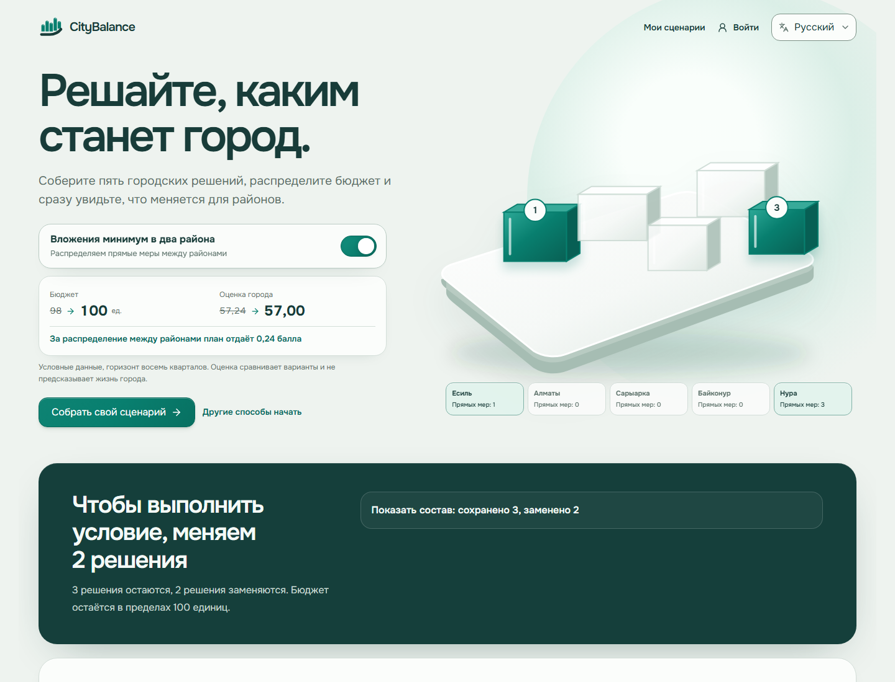
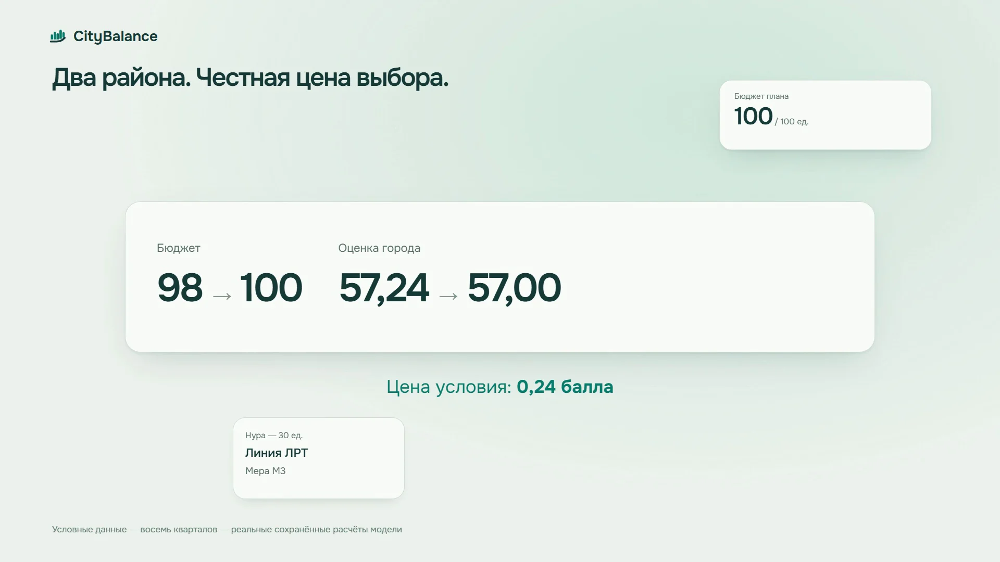
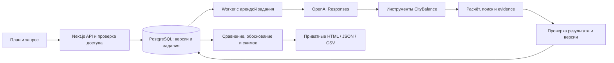

# CityBalance

**Решайте, каким станет город.**

Муниципальному аналитику мало найти набор мер с высоким баллом: нужно сохранить обещания жителям, понять цену приоритетов и защитить решение перед командой. CityBalance превращает бюджет и ограничения в сохранённый план: пять мер, изменения по районам, проверка рисков, редактируемое обоснование и файлы для обсуждения.

**[Открыть работающий CityBalance](https://solovibe-5k5wvv7zo.gobrev.dev/ru)**

[Пример готового документа](https://solovibe-5k5wvv7zo.gobrev.dev/examples/citybalance-two-districts-ru.html)



Реальный интерфейс: условие двух районов меняет распределение бюджета и показывает уступку по оценке города.

   

## Видимая цена приоритета

На данных кейса «Аким на 5 часов» требование направить районные меры хотя бы в два района меняет лучший допустимый портфель:

| Условие | Стоимость, условные единицы | Score |
| --- | ---: | ---: |
| Без дополнительного требования | 98 | 57.236735 |
| Прямые вложения минимум в два района | 100 | 56.997700 |
| Цена добавленного приоритета | +2 | −0.239035 |

Три решения сохраняются. Вместо адаптивных светофоров для города и спортивных площадок в Нуре появляются школа в Нуре и безопасные переходы в Есиле. Лёгкий рельсовый транспорт, семейная клиника в Нуре и городские аварийные бригады остаются. Это результат полного перебора в реализованной модели, воспроизводимый тестами, а не число из ответа модели языка.

Данные синтетические: Score помогает сравнивать решения внутри кейса и не является прогнозом качества жизни. Общегородское влияние и прямое районное вложение учитываются отдельно.

## Демонстрация

[](https://solovibe-5k5wvv7zo.gobrev.dev/media/citybalance-demo.mp4)

[Смотреть опубликованное видео со звуком](https://solovibe-5k5wvv7zo.gobrev.dev/media/citybalance-demo.mp4). 60 секунд, 1920×1080, русские тексты, без озвучки. Это ссылка на MP4 сайта, не GitHub-вложение.

## Один связанный рабочий процесс

1. **Собрать план.** Выбрать ровно пять разных мер из четырнадцати, назначить районы, увидеть бюджет, конфликты и изменения десяти показателей в пяти районах. Неполный черновик сохраняется, но не получает официальный Score.
2. **Зафиксировать обязательства.** Закрепить школу в Нуре, ограничить расходы, потребовать охват районов или направлений. Поиск сохраняет допустимые альтернативы; несовместимые условия возвращают объяснение вместо выдуманного решения.
3. **Сравнить и выбрать.** Посмотреть различия мер, районов и компонентов Score, оценить цену одного условия, применить вариант или вернуться к предыдущей версии. История не перезаписывается.
4. **Проверить риск.** Увеличить стоимость выбранной меры или её задержку, сопоставить исходный и изменённый результат, найти исправление при том же допущении. Чувствительность явно отделена от официального расчёта.
5. **Подготовить обоснование.** Сформировать документ по сохранённой версии, отредактировать авторский текст, уточнить отдельные разделы. Обновление сохраняет правки и помечает изменившиеся основания. Есть отдельный режим представления и печать браузером в PDF.
6. **Передать результат.** Скачать автономный HTML, JSON или CSV; открыть работу позднее; создать замороженный снимок с выбранными файлами, сравнить до трёх совместимых командных решений и отозвать ссылку.

Интерфейс поддерживает русский, қазақша и English; выбор языка сохраняется. Переключение языка интерфейса не переводит заново авторский текст. Можно начать гостем, затем создать аккаунт и перенести сохранённую работу без перемещения файлов.

## Как AI участвует в работе

Запрос пользователя связывается с конкретной принадлежащей ему ревизией, условиями, предыдущими сообщениями и сохранёнными наблюдениями. OpenAI Responses API выбирает инструменты и формулирует объяснение. Числа, допустимость и источники проверяет код CityBalance.



- `src/features/city/engine.ts` и `search.ts` реализуют расчёт и конечный поиск. Они учитывают задержки, синергии, ограничения, обрезку показателей до 0..100 и строгий порог критичности `< 40`. Формула: `Score = 0.7 × среднее с весами населения + 0.3 × минимум района − число критических показателей`. Промежуточного округления нет.
- `src/server/city/ai/` предоставляет инструменты чтения источников, поиска, сравнения, цены условия, stress/repair, сохранения альтернатив, анализа и документа. Сохранение проверяет владельца, ограничения и ссылки на evidence. Утверждение об оптимальности допустимо только после полного поиска для данных условий.
- `src/server/city/jobs.ts` и `runtime/city-worker.ts` исполняют долговечные задания. PostgreSQL хранит события, результаты инструментов и квитанции выполнения. Аренда на 30 секунд обновляется каждые 10 секунд; fencing token запрещает запись потерявшему аренду worker. Отмена и удаление блокируют последующие записи. Повторное выполнение использует уже сохранённые результаты.
- Ревизии сценария и версии документа неизменяемы; операции применения и редактирования используют compare-and-swap. Запоздалый AI-ответ не заменяет новые пользовательские правки. Идемпотентные запросы возвращают ранее созданные результаты.
- Better Auth обслуживает аккаунты. Гостю выдаётся HttpOnly cookie с случайным токеном; в БД хранится хеш. Владение проверяется сервисами, API и инструментами, а не наличием кнопки в интерфейсе.
- `exports.ts`, `artifact-access.ts`, `cleanup.ts` связывают файл с владельцем, источником, форматом, backend и SHA-256. `ready` устанавливается после проверки записанных байтов. Незавершённая запись остаётся отслеживаемой; удаление сначала отзывает доступ, затем повторяет очистку точного объекта. HTML экранирован и не требует внешних ресурсов, CSV защищает текст от формул.
- Снимок команды фиксирует опубликованную версию. В БД хранится только хеш случайного токена ссылки. Каждый запрос данных и скачивания повторно проверяет доступ; URL объекта хранилища не выдаётся.

Полный перебор подходит конечному каталогу кейса и даёт проверяемый ответ. Для большого реального каталога понадобятся другой алгоритм поиска и калиброванные источники стоимости и эффектов.

## Запуск с чистого клона

**[Публичная версия без локальной установки](https://solovibe-5k5wvv7zo.gobrev.dev/ru)**

Нужны Git, **Node.js >= 22.22.3**, **pnpm 10.32.1**, Docker Engine с Compose, поддерживающим `up --wait` и BuildKit. На Windows/macOS используется Docker Desktop с Linux-контейнерами; на Linux можно использовать Docker Engine и Compose plugin. Проверка чистого запуска выполнена на Windows с Docker Engine 29.4.3 и Compose 5.1.3.

```bash
git clone https://github.com/BAITC-Hacks/hack-e9b18f40-solovibe.git
cd hack-e9b18f40-solovibe
corepack enable
corepack prepare pnpm@10.32.1 --activate
pnpm env:init
pnpm local:up
```

`env:init` создаёт `.env` из `.env.example`, генерирует пароль PostgreSQL и секрет сессий, сохраняет существующий `.env`. После подготовки окружения **одна команда `pnpm local:up`** собирает приложение, ждёт PostgreSQL, применяет миграции и seed, запускает app и worker, проверяет их здоровье. Установка пакетов выполняется внутри Docker; локальный `pnpm install` для этого запуска не требуется.

Откройте [localhost:3000](http://localhost:3000). Проверка готовности: [api/health](http://localhost:3000/api/health), ожидаются `status: ok` и `worker.status: ok`. PostgreSQL доступен только через loopback-порт `15432`. Данные и локальные файлы находятся в отдельных Docker volumes `postgres-data` и `file-data`. `pnpm local:stop` останавливает контейнеры, сохраняя данные.

**API-ключи для ручного сценария не нужны.** Без OpenAI приложение, расчёты, поиск, сохранение и экспорт продолжают работать; AI-запрос получает `AI_UNAVAILABLE`. Чтобы включить AI, добавьте ключ в `.env` и снова выполните `pnpm local:up`. При полностью пустых настройках R2 файлы сохраняются в постоянном локальном volume. Приватная конфигурация Codex, `agents/` и доступ к серверу команды для запуска не нужны.

### Параметры окружения

Все пользовательские настройки перечислены в `.env.example`; секреты не должны попадать в Git.

| Переменная | Назначение и значение по умолчанию |
| --- | --- |
| `POSTGRES_DB`, `POSTGRES_USER` | База и пользователь, по умолчанию `solovibe`. |
| `POSTGRES_PASSWORD` | Обязательный пароль БД. Генерируется `env:init`; на сервере используйте собственный случайный пароль. |
| `POSTGRES_PORT` | Локальный проброс БД, `15432`. В production Compose БД не публикует порт. |
| `DATABASE_URL` | Подключение для команд, выполняемых на хосте. Генерируется для `127.0.0.1:15432`; Compose самостоятельно использует внутренний адрес `db:5432`. При смене локального порта обновите URL. |
| `APP_PORT` | Loopback-порт приложения, `3000`. |
| `APP_URL` | Полный публичный origin для сессий, ссылок и проверки Origin. Локально `http://localhost:3000`; на сервере обязательно свой HTTPS origin. |
| `BETTER_AUTH_SECRET` | Обязательный секрет сессий, генерируется `env:init`. Сохраняйте постоянным между перезапусками. |
| `OPENAI_API_KEY` | Необязательный ключ проекта OpenAI с доступом к выбранной модели Responses API. Получается в кабинете OpenAI; используется только сервером. |
| `OPENAI_MODEL` | Модель, по умолчанию `gpt-6-luna`; service tier `default`. У аккаунта должен быть доступ к этой модели. |
| `CITY_AI_NETWORK_HOURLY_LIMIT` | Часовой сетевой предел гостевых AI-запросов, `60`. Ручные расчёты его не расходуют. |
| `STORAGE_BACKEND` | Пусто: local при отсутствии R2, R2 при полном наборе настроек. Можно явно выбрать `local` или `r2`. Частичная конфигурация R2 возвращает ошибку. |
| `STORAGE_LOCAL_DIR` | Каталог для нативного запуска, `storage`. Compose задаёт `/app/storage` в постоянном volume. |
| `R2_ACCOUNT_ID`, `R2_ENDPOINT` | Для R2 нужен account ID либо S3 endpoint. При заданном ID endpoint вычисляется автоматически. Значения доступны в Cloudflare R2. |
| `R2_BUCKET` | Имя существующего приватного bucket. Публичный доступ не требуется. |
| `R2_ACCESS_KEY_ID`, `R2_SECRET_ACCESS_KEY` | S3 credentials токена Cloudflare с Object Read & Write для выбранного bucket. |
| `APP_REVISION` | Для production обязательный точный Git SHA; локально `local`. App и worker должны иметь одинаковое значение. |
| `CITY_REQUIRE_WORKER`, `CITY_WORKER_ID` | Compose задаёт `1` и `primary`: health учитывает свежий heartbeat worker. При нескольких нативных workers назначьте разные ID. |
| `RUN_MIGRATIONS` | Опциональный режим контейнерного entrypoint: `1` запускает миграцию перед app. В описанных командах используется отдельный сервис `migrate`. |

После сбоя R2 приложение не переключается скрыто на local. Смена backend существующих файлов требует отдельной миграции; автоматического переноса нет.

## Сценарий для проверки жюри

1. Откройте исходный пример: школа, клиника и освещение в Нуре, городская платформа обращений, чистое топливо в Сарыарке. Его стоимость **95**, Score **56.543070**.
2. Закрепите школу в Нуре и потребуйте прямые вложения минимум в два района. Попросите помощника: **«Сохрани школу в Нуре, вложись минимум в два района и предложи допустимый план. Объясни, чем приходится поступиться.»** Без ключа выполните поиск через условия.
3. Сравните сохранённую альтернативу с исходным планом, проверьте закреплённую школу и примените вариант. Откройте сценарий повторно: выбранная ревизия должна сохраниться. Формулировка AI может различаться, ограничения и числовые ссылки проверяются кодом.
4. Увеличьте стоимость одной выбранной меры на 20%. Если бюджет превышен, увидите недопустимость вместо официального Score. Найдите исправление под тем же допущением и сравните его с исходным.
5. Создайте обоснование, измените текст раздела вручную, обновите источник и проверьте сохранение авторской правки. Экспортируйте документ, откройте снимок по ссылке, затем отзовите её: новый запрос больше не должен получить данные.

## Проверки и измерения

Для команд на хосте после Docker quickstart установите зависимости: `pnpm install --frozen-lockfile`. `.env` должен указывать на тестовую локальную БД. Интеграционные проверки создают собственные сценарии или временные схемы; не направляйте тесты в чужую рабочую БД.

| Команда | Проверяет |
| --- | --- |
| `pnpm check` и `pnpm build` | TypeScript, ESLint, production-сборку app и worker. |
| `pnpm test:domain` | Арифметику, полный поиск, ограничения, атрибуцию и правила evidence. |
| `pnpm test:state` | Клиентские переходы состояния и обработку намерения. |
| `pnpm test:integration` | Реальный HTTP: сохранение, CAS, две гостевые сессии, auth/claim, права. |
| `pnpm test:worker` | Квитанции, повторное выполнение, lease/fencing, отмену, лимиты. |
| `pnpm test:workshop`, `pnpm test:brief` | Поиск, историю, сравнения, версии и защищённые авторские правки. |
| `pnpm test:exports`, `pnpm test:shares` | Байты и SHA-256, локальное хранилище, сбои записи/finalize, приватность, snapshot/revoke. |
| `pnpm test:retention` | Удаление исходного владельца без потери чужой копии. |
| `pnpm exec tsx --conditions=react-server runtime/test-city-run-idempotency.ts` | Повтор AI-запроса после изменения brief version, чужого владельца и удалённый parent. |
| `pnpm verify:journey` | Связанный HTTP-путь без обращения к AI по умолчанию. |
| `pnpm verify:delivery` | Изолированную цепочку stress, brief, export и sharing. |
| `pnpm verify:ai` | Намеренный реальный вызов OpenAI; требует ключ и расходует API-бюджет. |

`CITY_TEST_URL` выбирает HTTP origin проверок. Флаги `CITY_JOURNEY_LIVE=1`, `CITY_DELIVERY_LIVE=1` и `CITY_BRIEF_LIVE=1` включают реальные provider-вызовы в соответствующих проверках; по умолчанию они выключены. `CITY_VERIFY_CASE=v3|v4|both` выбирает live AI-проверку; `CITY_DELIVERY_CASE=brief` ограничивает live delivery-проверку документом. `CITY_VERIFY_CLEANUP_ON_FAILURE=true` удаляет тестовые записи verify:ai и при неуспешной проверке.

Наблюдавшиеся результаты, а не обещания задержки:

- Полный перебор **694 395** допустимых планов воспроизводит максимум **57.236735**; условие всех пяти направлений даёт **68 200** вариантов. Локальный benchmark поиска составил около **5.9 с**, прирост RSS около **12 MiB**.
- Реальный AI-сценарий с сохранением школы, записанной альтернативой и применением занял **36.5 с**; проверка несовместимых условий с объяснением заняла **11.9 с**.
- Отдельная связанная HTTP-проверка с live AI, stress/repair, ручной правкой документа, экспортом и отзывом снимка заняла **34.6 с**. Это другой прогон с другими входами.
- Чистый запуск V9 проверен без `agents/`, прежней БД и ключей OpenAI/R2. После пересоздания app сохранённая ревизия и JSON-файл **51 000 байт** сохранились с тем же SHA-256; app и worker были healthy. Использовался Docker cache зависимостей. Источник V9 предшествовал двум исправлениям export retry и run idempotency; сами исправления прошли отдельные регрессии, startup/dependencies не менялись.
- Проверены source-bound brief, cross-owner denial, восстановление после put/DB-finalize failure и отзыв ссылки. Local и отдельно настроенный приватный R2 проверялись раздельно; V9 проверял именно local fallback.

## Самостоятельное размещение на сервере

Нужны Linux-сервер с Docker/Compose, DNS, HTTPS и собственные runtime secrets. Доступ к инфраструктуре команды не требуется. Клонируйте репозиторий, выполните `pnpm env:init`, задайте в `.env` свои `POSTGRES_PASSWORD`, `BETTER_AUTH_SECRET`, `APP_URL=https://city.example.org`; ключи AI/R2 необязательны. Пример origin замените своим доменом.

```bash
export APP_REVISION="$(git rev-parse HEAD)"
docker compose -f compose.production.yaml build app
docker compose -f compose.production.yaml up -d --wait --wait-timeout 120 db
docker compose -f compose.production.yaml run -T --rm --no-deps migrate
docker compose -f compose.production.yaml up -d --no-deps --no-build --wait --wait-timeout 120 app worker
curl --fail http://127.0.0.1:3000/api/health
```

`compose.production.yaml` использует один образ с точным SHA для app, worker и миграции. PostgreSQL не выставлен наружу; app слушает loopback. Сохраняйте оба volumes при обновлении и делайте резервные копии БД и файлов согласованно. Не применяйте `down --volumes` к рабочим данным. Для отдельного тестового запуска задайте свой Compose project, порты и image; одного изменения project name недостаточно для уникального тега образа.

Выпустите TLS-сертификат своего домена и поставьте Nginx перед `127.0.0.1:3000`. Минимальные существенные настройки HTTPS virtual host:

```nginx
server {
    listen 443 ssl;
    server_name city.example.org;
    ssl_certificate /etc/letsencrypt/live/city.example.org/fullchain.pem;
    ssl_certificate_key /etc/letsencrypt/live/city.example.org/privkey.pem;
    proxy_http_version 1.1;
    proxy_set_header Host $host;
    proxy_set_header X-Forwarded-Host $host;
    proxy_set_header X-Forwarded-Proto https;
    proxy_set_header X-Real-IP $remote_addr;
    proxy_set_header X-Forwarded-For $proxy_add_x_forwarded_for;
    proxy_set_header Connection "";
    proxy_buffering off;
    proxy_cache off;
    proxy_read_timeout 300s;
    proxy_send_timeout 300s;
    location ~ ^/(api/city/shares/view/|(ru|kk|en)/share/) {
        access_log off;
        error_log /dev/null;
        add_header Referrer-Policy no-referrer always;
        add_header X-Robots-Tag "noindex, nofollow" always;
        proxy_pass http://127.0.0.1:3000;
    }
    location / { proxy_pass http://127.0.0.1:3000; }
}
```

Проверьте `nginx -t`, перезагрузите Nginx и запросите `https://city.example.org/api/health`: app/worker должны сообщать один SHA. Отключённая буферизация нужна для своевременных SSE-событий и восстановления потока. URL снимков содержит токен доступа: не записывайте его в proxy/CDN access logs. В публичном развёртывании команды HTTPS завершается на Brev Secure Link, далее используется Nginx; собственный сервер может завершать TLS непосредственно на Nginx.

## Границы текущей версии

Каталог ограничен данными кейса: пять районов, десять показателей, четырнадцать мер и горизонт восемь кварталов. Нет подключения к реальным муниципальным данным, прогноза жителей или денежных эффектов. Одновременно выбираются пять разных мер, максимум две из одного направления; охват всех пяти направлений является дополнительным условием.

AI имеет общий deadline 120 секунд, до восьми инструментальных шагов, трёх поисков и 4000 output tokens. Два глобальных исполнительных слота, одна активная задача на quota key; до двух попыток восстановления worker. Лимит AI: 10 запусков в час для гостя, 30 для аккаунта. Модель и сеть влияют на время и доступность; сохранённые ручные результаты от них не зависят.

Гостевые данные хранятся 30 дней после последней активности; аккаунт сохраняет работу за пределами этого срока. Лимиты библиотеки: 10 живых сценариев гостя и 100 аккаунта. Снимки действуют до 30 дней или до отзыва; последующие приватные изменения не публикуются автоматически. Уже скачанные файлы отозвать невозможно. Размер одного экспорта ограничен 10 MiB. PDF получается через печать браузера, отдельного серверного PDF-генератора нет. Совместного редактирования в реальном времени нет.

## Используемые материалы

Кейс HackAlem «Аким на 5 часов» и предоставленный синтетический датасет районов служат предметным источником. Исходный текст сохранён в `agents/knowledge/cases/akim-dataset.md`, рабочая версия с идентификаторами и хешами находится в `src/features/city/data/akim-v1.ts`. Расчёт, поиск, источники чисел и тестовые портфели реализованы в коде продукта. HackAlem является событием, SoloVibe является командой, CityBalance является названием продукта.

Для организации разработки использовались личная конфигурация среды Codex (`.codex/config.toml`) и текстовая база знаний (`AGENTS.md`, `agents/knowledge/`). Конфигурация задаёт параметры работы агентов. База содержит инженерные и дизайн-рекомендации, справочные материалы по интеграциям, требования к качеству и критерии хакатона. Критерии конкретного кейса, план разработки и рабочие заметки добавлены после получения задания.

База также описывает рабочий процесс: обсуждение концепции, планирование, разделение этапов и задач, согласование интерфейсов, проверку результатов и передачу контекста. Это инструкции по организации работы. Концепция, предметная модель и сценарии выбранного кейса формировались отдельно. В рабочем пространстве была и исполняемая подготовка: Next.js/TypeScript foundation, auth, адаптеры AI и хранения, PostgreSQL/Drizzle, контейнеризация и workflow-скрипты. Она использована и расширена для CityBalance; весь исходный workspace не является исключительно текстовой подготовкой.

Использованы открытые библиотеки Next.js, React, TypeScript, Tailwind CSS, next-intl, Better Auth, Drizzle ORM, postgres.js, AI SDK, AWS SDK, Zod, Radix UI, Lucide и Motion; точные версии фиксирует `pnpm-lock.yaml`. OpenAI предоставляет модель языка, Cloudflare R2 предоставляет опциональное приватное объектное хранилище. Шрифт **Onest**, © The Onest Project Authors, распространяется по **SIL Open Font License 1.1** и подключён через Fontsource. Фирменный знак и схематические городские композиции сделаны для CityBalance; они не изображают точную географию Астаны. Сторонние фотографии и вымышленные пользовательские отзывы не используются.

Видеодемонстрация создана в Hyperframes 0.8.33 с локальным GSAP. Исходники: `video/index.html`, `video/timeline.js`, `video/audio-source.py`. Музыка и эффекты созданы для проекта процедурно без сторонних записей; сведения о происхождении находятся в `video/assets/audio/credits.txt`. Монтаж сокращает ожидание, но использует реальные сохранённые сценарии и документ. Для воспроизведения визуального рендера: `pnpm --dir video run render --output renders/citybalance-silent.mp4 --fps 30 --resolution 1080p`; затем FFmpeg объединяет его с `video/assets/audio/mix.wav` без перекодирования изображения.
